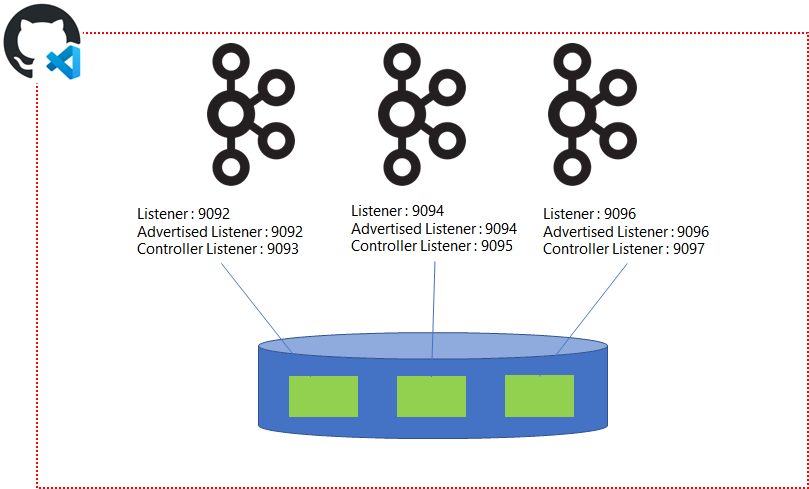

# KRaft 기반 Kafka Cluster 생성 및 내부구조 확인

> KRaft Cluster 내부 Controller 속성 확인 및 토픽 파티션 관리 방법 습득 목적

<br>

## 목차

0. [Kafka 설치 사전 준비](#0-kafka-설치-사전-준비)
1. [Kafka Cluster 생성](#1-kafka-cluster-생성)
2. [Topic 생성 및 설정 변경](#2-topic-생성-및-파티션-정보-확인)
3. [Preferred Leader Election 수행](#3-preferred-leader-election-수행하기)
4. [수동 Partition Reassignment 수행](#4-partition-reassign-수동-실습하기)
5. [Log 파일 내용 확인](#5-produce-내용-적재된-log-파일-dump-확인)
6. [실습 환경 정리](#6-kafka-cluster-중지)

<br>

## 실습 환경

<p align="center">
    
</p>

<br>

- Codespace VM 한대에서 3대 Kafka Broker 설치하여 Cluster 구성
- 3대의 Broker는 Controller와 Broker 역할을 모두 수행함
- VM 한대에 설치되므로 각각 Broker의 Port 및 Log 저장위치 모두 다르게 구성

<br>


<br>

---

## 0. Kafka 설치 사전 준비

1. 실습 디렉토리 이동

```
cd 01_self/00_pre_setting
```

<br>

2. Kafka 프로그램 및 Kafkacat 설치

```
./01_install_kafka.sh
```

<br>

3. Kafka 환경설정

```
source 02_set_environment_P.sh
```
<br>

환경설정 Shell 파일 수행시에는 **source** 명령어를 통해 수행해야한다.
그 이유는 sh 혹은 ./ 로 Shell 파일을 실행 시킬 경우 자식 Shell로 동작하지만, 환경 설정의 경우 부모 Shell의 설정을 변경시켜야 되기 때문이다.

<br>

4. 상위 디렉토리 이동

```
cd ..
```

---

<br>

## 1. Kafka Cluster 생성

> KRaft Cluster 생성 및 Controller 정보 확인 목적


<br>

1. 실습 디렉토리 이동

```
cd 01_setup_kafka_cluster
```

<br>

2. Kafka Cluster Config 설정

```
./01_modify_broker_setting.sh
```

<br>

해당 스크립트는 기본 Kafka Broker Config를 3본 복제하여, Cluster 속성 지정함. 변경되는 속성은 다음과 같음

<br>

- Cluster Node Id 지정(1~3)
- Listener 지정
    - Node 1(localhost:9092)
    - Node 2(localhost:9094)
    - Node 3(localhost:9096)
- Advertised Listener 지정
    - Node 1(localhost:9093)
    - Node 2(localhost:9095)
    - Node 3(localhost:9097)
- Quorum Voertes 지정
- Log 저장 위치 지정
    - Node 1(/tmp/kraft-combined-logs-1)
    - Node 2(/tmp/kraft-combined-logs-2)
    - Node 3(/tmp/kraft-combined-logs-3)

<br>

3. Log 디렉토리에 Cluster 기본 설정 파일 생성

```
./02_set_cluster_id.sh
```

<br>

해당 Cluster를 구분하기 위한 Cluster UUID 생성 후 log.dirs 위치에 메타데이터 생성

<br>

4. Cluster 구동

```
./03_run_kafka_cluster.sh
```

<br>

Broker Cluster 구동 및 Log 디렉토리 지정
- Node 1(/home/workspace/kafka_2.13-3.5.0/logs/server_1)
- Node 2(/home/workspace/kafka_2.13-3.5.0/logs/server_2)
- Node 2(/home/workspace/kafka_2.13-3.5.0/logs/server_3)

<br>


5. Java Process Status 확인

```
jps | grep -v Jps
```

<br>

JVM에서 기동중인 Process 상태를 확인하는 명령어로 Kafka 또한 JVM 위에서 기동되므로 해당 명령어를 통해 현재 프로세스 기동 여부를 확인할 수 있다.

<br>

6. controller 로그 확인

```
./04_check_controller_log.sh
```

<br>

Enter Node id: 1

<br>

※ Controller 로그 확인할 Node id를 입력(1~3)한다. 위 예시는 1번 Node의 Controller 로그를 확인하는 예제이다.
Controller 로그를 통해 리더 선출 완료 및 Broker가 Controller를 통해 접속 했음을 확인한다.

<br>

7. Broker 로그 확인

```
./05_check_broker_log.sh
```

<br>

Enter Node id: 1

<br>

※ Broker 로그 확인할 Node id를 입력(1~3)한다. 위 예시는 1번 Node의 Broker 로그를 확인하는 예제이다.
Broker 로그를 통해 Kafka Cluster가 완전히 기동 완료 되었음을 확인한다.

<br>

8. Controller 상태 확인

```
./06_check_controller_status.sh
```

<br>

어떤 Node가 현재 Leader이며, Leader Epoch는 무엇인지 현재 Lag가 발생한 Follower Controller 정보 확인 가능

<br>

9. Controller Replication 상세 정보 확인

```
./07_check_controller_replication.sh
```

<br>

Controller Pool에 해당하는 Controller들 간의 상태와 Timestamp, Lag 정보 확인 가능

<br>


### 1-1. 1번 실습 종료

<br>

1번 실습이 끝나면, 다음 실습을 위해 상위 디렉토리로 이동한다.

<br>

1. 상위 디렉토리 이동

```
cd ..
```

<br>

---

## 2. Topic 생성 및 파티션 정보 확인

> Partition 개수가 지정된 Topic 생성 및 생성 정보 확인 목적

<br>

1. 실습 디렉토리 이동

```
cd 02_topic
```

<br>

2. Topic 생성

```
./01_create_topic.sh
```

<br>

Partition 3개에 Replication Factor 3으로 지정되어 총 3개의 Partition Leader와 6개의 Follower로 구성된 Replica가 생성된다.

<br>

3. Topic 정보 확인

```
./02_describe_topic.sh
```

<br>

Topic Partition 갯수, Replication Factor 갯수 각 Partition 별 Leader 정보와 Replicas, Isr 정보 확인 가능

<br>

4. Topic 상세 설정 확인

```
./03_describe_topic_config.sh
```

<br>

해당 토픽에 지정된 설정 값 전부를 보여줌

<br>

5. Topic 설정 변경

```
./04_add_topic_config.sh
```

<br>

Topic에 지정된 설정 변경함. 위 코드는 index.interval.bytes 값을 기본 4096에서 1024로 변경하는 예제 프로그램

<br>

6. Dynamic Topic 변경 내용 확인

```
./05_describe_topic_dynamic_config.sh
```

<br>

동적으로 설정 변경된 값 확인 가능

<br>

7. Topic 설정 변경 내용 삭제

```
./06_remove_topic_config.sh
```

<br>

동적으로 설정 변경한 값 삭제함. 삭제하면 해당 값은 기본 값으로 변경됨

<br>

8. Topic 변경 삭제 후 Dynamic topic 변경 내용 확인

```
./05_describe_topic_dynamic_config.sh
```

<br>

동적으로 설정 변경 삭제한 이후 6번 과정 재수행하면, index.interval.bytes 변경 값이 기본 값으로 변경되었으므로 더 이상 조회되지 않음

<br>


### 2-1. 2번 실습 종료

<br>

2번 실습이 끝나면, 다음 실습을 위해 상위 디렉토리로 이동한다.

<br>

1. 상위 디렉토리 이동

```
cd ..
```

<br>

---

## 3. Preferred Leader Election 수행하기

> 임의로 Broker 중단 하여 Leader Skew 상황 만든 다음 수동으로 Preferred Leader Election 수행 목적

<br>

1. 실습 디렉토리 이동

```
cd 03_preferred_leader
```

<br>


2. 임의의 Broker Shutdown 시켜 파티션 리더 재선출

```
./01_shutdown_broker.sh 1
```

<br>

위 코드는 1번 Broker 및 Controller를 기동 중지하는 예제로써 프로그램 실행 시 인자로 node id를 전달하면 해당 인스턴스 종료됨

<br>

3. Topic 정보 확인

```
./describe_topic.sh
```

<br>

Broker 종료 이후 Topic 정보를 확인하면, Partition Leader 종료로 인하여 Leader 재선출이 일어남을 확인할 수 있음

<br>

4. 중지 시킨 Broker 재기동

```
./02_run_broker.sh 1
```

<br>

이전에 기동 중지했던 Broker를 다시 기동시킴

<br>

5. Topic 정보 확인

```
./describe_topic.sh
```

<br>

Broker 재기동 이후 Topic 정보를 확인하면, 재기동한 Broker가 Message를 따라잡으면 ISR에 포함되지만, 해당 Broker로 다시 Leader가 바뀌지는 않음

<br>

6. Preferred Leader json 파일 확인

Topic 최초 생성 시, 지정된 replicas에 가장 첫번째가 Preferred Leader임. 따라서 해당 Topic Partition에 대하여 Preferred Leader로 재선출하도록 요청할 수 있음. 요청 전달 시 json 포맷으로 Topic과 Partition 정보를 전달해야함

```
cat preferred_leader.json
```

<br>

7. Preferred Leader Election 수행

```
./03_elect_preferred_leader.sh
```

<br>


8. Topic 정보 확인

```
./describe_topic.sh
```

<br>

Preferred Leader Election 수행 결과, Leader Skew 현상에서 벗어나서 균형잡힌 Partiton Leader 분배였던 초기 모습으로 돌아감 확인

<br>


### 3-1. 3번 실습 종료

<br>

3번 실습이 끝나면, 다음 실습을 위해 상위 디렉토리로 이동한다.

<br>

1. 상위 디렉토리 이동

```
cd ..
```

<br>

---

## 4. Partition Reassign 수동 실습하기

> 수동으로 Partition Reassign을 통해서 Broker Skew 상황 만들기 목적

<br>

1. 실습 디렉토리 이동

```
cd 04_reassign_partition
```

<br>


2. json 파일 살펴보기

```
cat reassign_partition_manual.json
```

<br>

토픽의 각 파티션별로 Replica를 임의로 지정한 것을 확인할 수 있다. 이때 모든 파티션에 대해서 Replica를 1,2,3으로 고정하므로 이때 Preferred Leader는 전부 1번이다. 따라서 해당 json을 기반으로 Partition Reassignment를 수행하면 Leader 및 Broker 불균형이 발생한다.

<br>

3. Topic 상태 살펴보기

```
./describe_topic.sh
```

Topic 정보를 보면, Partition Reassignment를 수행하기 이전에는 균형있게 Replica가 배치된 것과 Partition Leader가 3개의 Broker에 적절하게 배치되어있음을 볼 수 있다.

3. Partition Reassign 수행하기

<br>

```
./01_reassign_partition.sh
```

<br>

Partition Reassignmnet를 수행할 때, 기존 Replica 구성이 어떻게 되어있는지 화면에 출력해준다. 따라서 이를 복사해서 저장했다가 나중에 원복할 수 있다.

<br>

4. Topic 상태 살펴보기

```
./describe_topic.sh
```

<br>

Topic 상태를 살펴보면, Replica들이 변경된 것을 알 수 있다. 하지만 Partition Reassignment를 수행했다고 해서 Partition Leader가 변경되지는 않는다. 따라서 이를 위해서는 Preferred Leader Election을 수행해야한다.

<br>

---

5. Preferred Leader Election 수행하기

```
./02_elect_preferred_leader.sh
```

<br>

지정된 Replica를 기준으로 Preferred Leader를 선정한다.

<br>

6. Topic 상태 살펴보기

```
./describe_topic.sh
```

<br>

Topic 상태를 보면 모두 1번 Broker로 Leader가 지정됨을 볼 수 있다.

<br>


### 4-1. 4번 실습 종료

<br>

4번 실습이 끝나면, Topic을 삭제하고 다음 실습을 위해 상위 디렉토리로 이동한다.

<br>


1. Topic 삭제

```
./03_delete_topic.sh
```

해당 실습 종료를 위해 토픽을 삭제한다.

<br>

2. 상위 디렉토리 이동

```
cd ..
```

<br>

---


## 5. Produce 내용 적재된 Log 파일 Dump 확인

> Log 및 index 적재 내용을 확인하여 실제 Disk에 저장되는 데이터 확인 목적

<br>

1. 실습 디렉토리 이동

```
cd 05_check_dump
```

<br>


2. Topic 생성하기

```
./01_create_new_topic.sh
```

<br>

실습을 위해 신규 Topic test-topic-log을 생성한다. 이때 index dump 파일 확인을 위해 index.interval.bytes 값을 500으로 지정하였다. 또한 Partition 및 Replication Factor를 3으로 지정하여 모든 Broker에 Log가 적재되도록 구성했다.

<br>


3. Topic 정보 확인

```
./02_describe_topic.sh
```

<br>

생성된 Topic 정보를 확인한다.

<br>

4. 대량 데이터 발행

```
./03_produce_topic.sh
```

<br>

dummy.json 파일에 있는 2000여개 json 데이터를 발행하여 Broker Log에 적재한다.

<br>

5. Log 파일 확인

```
./04_check_files.sh
```

<br>

Broker 1번 로그 파일 디렉토리를 확인하여 해당 Topic Log 파일이 정상적으로 생성되었는지 확인한다.

<br>

6. Index 파일 dump 확인하기

```
./05_dump_index.sh
```

<br>

파일 시스템에 저장된 Index 파일 내용을 확인하여 실제 Log 파일에 대응되는 offset과 position을 확인한다.

<br>

7. Log 파일 dump 확인하기

```
./06_dump_log.sh
```

파일 시스템에 저장된 Log 파일 내용을 확인하여, 데이터가 정상적으로 disk에 저장됨을 확인한다.

<br>


### 5-1. 5번 실습 종료

<br>

5번 실습이 끝나면, 상위 디렉토리로 이동한다.

<br>


1. 상위 디렉토리 이동

```
cd ..
```

---

## 6. Kafka Cluster 중지


1. 자원 정리

```
./cleanup_resource.sh
```

<br>

Broker 1~3 노드를 모두 내리고 관련 로그파일을 삭제한다.

<br>

2. 상위 디렉토리 이동

```
cd ..
```