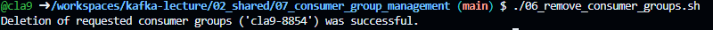

# 공용 Kafka Produce & Consume 실습

> 기본적인 Produce, Consume 과정 이해 및 Kafka 관리도구인 akhq와 UI for Apache Kafka를 체험해보는 것을 목표로 함.

<br>

## 목차
1. [기초 Produce, Consume 실습하기](#1-기초-produce-consume-실습하기)
2. [이전 발행 모든 메시지 읽기](#2-producer가-발행한-처음-메시지부터-데이터-가져오기)
3. [특정 offset 부터 메시지 읽기](#3-특정-offset-으로부터-데이터-가져오기)
4. [Consumer Group 테스트하기](#4-consumer-group-테스트하기)
5. [Multi json 데이터 한번에 발행하기](#5-multi-json-data-테스트하기)
6. [Up & Down 게임](#6-up--down-game)
7. [Consumer Group 관리](#7-consumer-group-관리)
8. [실습 환경 정리](#8-consumer--produce-전체-실습-중지)

<br>


## 실습 환경

<p align="center">
    
</p>

<br>

- github codespace(월 60시간 무료)에서 제공하는 VM 환경에서 Kafka 도구 설치
- Public Cloud에 설치된 Kafka Broker
- Kafka 도구를 통해서 Produce/Consume 수행

<br>

---

## 0. 실습 사전 준비

1. 실습 디렉토리 이동

```
cd 02_shared/00_pre_setting
```

<br>

2. Kafka 환경 설정

```
source 01_set_environment_P.sh

Enter your nick name : ※[실습시 개인별로 사용할 unique한 nick-name 입력]
Enter an IP address : ※[실습시 IP 주소 제공]

```
<br>

환경설정 Shell 파일 수행시에는 **source** 명령어를 통해 수행해야한다.
그 이유는 sh 혹은 ./ 로 Shell 파일을 실행 시킬 경우 자식 Shell로 동작하지만, 환경 설정의 경우 부모 Shell의 설정을 변경시켜야 되기 때문이다.

<br>

```
./02_check_environment.sh

위 명령어 수행 결과 nick-name, server-ip, kafka-home 모두 출력되면 정상
```

<br>

```
./03_install_kafkacat.sh

```

Kafka 사용 편의를 위해 개발된 오픈소스 Tool 설치

<br>

3. 상위 디렉토리 이동

```
cd ..
```

<br>

---

## 1. 기초 Produce, Consume 실습하기

> 기본 Produce, Consume 및 Kafka 관리 도구를 통해 해당 정보 확인 목표

<br>

1. 실습 디렉토리 이동
```
cd 01_basic_pub_sub
```


2. producer 프로그램 실행
```
./01_produce.sh
```

해당 프로그램은 공용 Kafka 서버 내에 있는 kafka-class 토픽을 대상으로 데이터 발행을 수행한다.


3. github codespace 화면 분할

<p align="center">
    
</p>


Consumer 프로그램 실행을 위해서 window 화면을 분할한다.

<br>

4. consumer 프로그램 실행

<p align="center">
    
</p>


```
./02_consume.sh
```

<br>

분할한 화면에서 consumer 프로그램을 실행한다. 이후 producer에서 메시지를 입력하여, consumer 프로그램에서 출력되는지 확인한다.

---

### 1-1. live-tailing 확인(AKHQ)


<br>

공용 Kafka 서버에는 AKHQ와 UI for Apache Kafka가 설치되어있다.
IP는 수업 시간에 공지하며, AKHQ는 **8081** 포트 UI for Apache Kafka는 **8080** 포트로 접속한다.

<br>


1. AKHQ live tail 확인하기

<p align="center">
    
</p>


<br>

AKHQ 페이지 접속한 다음 live tail 아이콘을 클릭하여 해당 페이지로 이동한다.

<br>

2. Topic 지정하기


<p align="center">
    
</p>

<br>

Live tail을 수행할 Topic인 kafka-class를 선택한다.

<br>

3. 검색 클릭

<p align="center">
    
</p>


검색 버튼을 클릭하여 live tail 기능을 수행한다. 이후 producer 프로그램에서 데이터를 발행하여 해당 Topic에 데이터가 쌓이는 것을 확인한다.

<br>

---

<br>

### 1-2. kafka-class offset 정보 확인(UI for Apache Kafka)


UI for apache kafka는 Kafka 관리도구 중 하나로써 Kafka Cluster 관리에 필요한 다양한 기능을 제공한다. 그 중 Topic 상세 정보를 한 번 살펴보자.

<br>

1. Topic 상세 정보창 이동

<p align="center">
    
</p>


Topic > Kafka-class Topic을 클릭하여, 상세 정보창으로 이동한다.

<br>

2. Topic 상세 기능 확인

<p align="center">
    
</p>

UI for apache kafka에서 제공하는 여러 기능을 테스트해본다.

<br>

### 1-3. 1번 실습 종료

<br>

1번 실습이 끝나면 codespace 화면 분할 종료 후, 다음 실습을 위해 상위 디렉토리로 이동한다.

<br>

1. 화면 분할 종료

<p align="center">
    
</p>


<br>

2. Producer 프로그램 종료

<p align="center">
    
</p>

<br>

3. 상위 디렉토리 이동

```
cd ..
```

<br>


---

<br>

## 2. Producer가 발행한 처음 메시지부터 데이터 가져오기

<br>

> 강사가 임의로 kafka-consumer-test Topic에 5개의 메시지(0~4)를 미리 발행하고 이후 **특정 시점에 모든 메시지를 가져오는 것** 확인 목표

<br>


1. 강사가 사전에 메시지 미리 발행

<br>

2. consumer 프로그램 실행

```
./02_consume_beginning_offset.sh
```

<br>

해당 프로그램은 kafka-consumer-test 토픽에 저장된 메시지를 읽어온다. 프로그램 기동 시 **--from-beginning** 옵션을 통해 해당 토픽에 저장된 모든 이전 메시지 정보를 읽어온다.

<br>

프로그램 종료는 CTRL + C를 눌러 종료한다.
<br>

---

## 3. 특정 offset 으로부터 데이터 가져오기


<br>

> 강사가 임의로 5개의 메시지(0~4)를 미리 발행하고 이후 **특정 시점에 특정 offset으로부터 메시지를 가져오는 것** 확인 목표

<br>

1. consumer 프로그램 실행

```
./03_consume_specific_offset.sh 
```

<br>

Enter offset: 3

<br>

프로그램 수행 시에 인자로 0~4 사이의 offset 번호를 입력하면, 해당 offset으로부터 메시지를 수신 받을 수 있다.

※ 위 예제는 3번 offset부터 메시지를 수신받는 테스트 프로그램 실행

<br>

프로그램 종료는 CTRL + C를 눌러 종료한다.
<br>

---

## 4. Consumer Group 테스트하기

<br>

> 파티션이 2개인 **consumer-group-test** Topic을 공용 Kafka Cluster에 미리 생성되어있는 환경에서 consumer 그룹 관련 기본 개념을 실습하는 것을 목표

<br>


### 4-1. Consumer Group 메시지 분배 확인


1. 실습 디렉토리 이동

```
cd 04_test_consumer_group
```

<br>


2. 패널 위치 변경


<p align="center">
    
</p>

<br>

먼저 터미널을 4개 띄워야되므로 터미널 위치를 변경하는 것이 좋다. 따라서 터미널 부근에 마우스 오른쪽 버튼을 클릭 > 패널 위치 > 왼쪽으로 설정한다.

<br>

3. 다중 Terminal 구성


<p align="center">
    
</p>


터미널을 분할하여 4개로 구성한다.

<br>


4. Producer 프로그램 실행

<p align="center">
    
</p>

<br>

1번 터미널
```
./01_produce.sh

```
<br>

Enter partition number: 0 

<br>


2번 터미널
```
./01_produce.sh
```

<br>

Enter partition number: 1

<br>

<br>

여기서 전달되는 인자는 partition 번호를 의미하며, consumer-group-test 토픽은 2개 파티션이 생성되어있음. 따라서 위 2개의 프로그램은 특정 파티션에 대해 메시지 발행을 목적으로 함.

<br>

※ Producer를 실행하기 위해 kafkacat 프로그램을 사용했는데, 이는 특정 파티션을 지정하기 위한 용도로 사용했음. 기본 제공 프로그램에서는 특정 파티션에 대해 메시지를 발행하는 기능이 없음

<br>

5. Consumer 프로그램 실행

<p align="center">
    
</p>

나머지 2개 터미널에서 consumer 프로그램을 수행한다.

```
./02_test_consumer_group.sh
```

<br>

두개의 Consumer 프로그램에는 사용자의 Nick-Name이 그룹명으로 지정되어있다. 따라서 별도 실행한 두 개의 프로그램은 동일한 Consumer Group으로 묶여있다.

<br>

6. 메시지 발행

<br>

터미널에서 생성한 두 개의 Producer 프로그램에서 번갈아가며 메시지를 임의로 발행한다. 이후 Consumer 프로그램에서 메시지들이 파티션별로 분배되어 출력되는 것을 확인한다.

<br>

---

### 4-2. Consumer 종료 시, 나머지 Consumer에서 메시지 처리 확인하기

<br>

1. Consumer 종료

<p align="center">
    
</p>

<br>

실행된 두 개의 프로그램 중 하나의 프로그램을 Ctrl + C를 입력하여 종료한다.

<br>

2. Consumer Rebalance 확인

Producer 프로그램에서 번갈아가며, 메시지를 발행하고 종료된 프로그램에서 처리하던 메시지가 하나의 Consumer 프로그램에서 모두 처리 되는 것을 확인한다.

---

### 4-3. Consumer Lag 확인하기

<br>

1. Consumer 프로그램 모두 종료


<p align="center">
    
</p>

<br>

기존에 수행중이던 Consumer 프로그램을 모두 종료한다.

<br>

2. Producer 메시지 발행

Consumer 프로그램 모두 종료 후, Producer에서 메시지를 추가로 몇 개 더 발행한다.

<br>

3. Lag 확인

<p align="center">
    
</p>

<br>

UI for Apache Kafka 웹페이지에서 Consumers를 클릭하여 자신의 Nick-Name에 해당하는 Consumer Group 정보를 확인한다.


<br>


### 4-4. 4번 실습 종료

<br>

4번 실습이 끝나면 codespace 화면 분할 종료 후, 다음 실습을 위해 상위 디렉토리로 이동한다.

<br>

1. 화면 분할 종료

<p align="center">
    
</p>

종료 버튼을 클릭하여 터미널을 1개만 유지하도록 지정한다.

<br>


2. 패널 위치 원래대로 설정하기

<p align="center">
    
</p>

터미널 상단바 부분에서 마우스 우클릭 > 패널 위치 > 아래 버튼을 클릭하여 터미널 위치를 원래 위치로 되돌린다.

<br>

3. 상위 디렉토리 이동

```
cd ..
```

<br>


---


## 5. Multi-json data 테스트하기

<br>

> json 데이터 여러개를 테스트 목적으로 한번에 발행하고 싶을 경우 파일로 저장하여 Producer 프로그램을 통해 전달하는 것을 목표

<br>

1. 실습 디렉토리 이동

```
cd 05_produce_file_content
```

<br>

2. dummy 데이터 확인

```
cat dummy.json
```

<br>

3. akhq kafka-class Topic live tail 기능 활성화

<p align="center">
    
</p>

<br>

4. Producer 프로그램 실행

```
./01_produce_file.sh
```

<br>

5. live tail을 통해 json 데이터가 멀티로 전달된 것 확인

<p align="center">
    
</p>

실시간 json 데이터 발행 확인

### 5-1. 5번 실습 종료

<br>

5번 실습이 끝나면 다음 실습을 위해 상위 디렉토리로 이동한다.

<br>


1. 상위 디렉토리 이동

```
cd ..
```

<br>


---

## 6. Up & Down Game 

<br>

<p align="center">
    
</p>

<br>

> 1. 사용자 Application 연결 정보 없이, Topic에 대한 메시지 발행/구독만으로 원격지 Application과 상호작용 목표
> 2. Producer 메시지 발행 시, 사용자 지정 헤더 지정 방법 학습

<br>

해당 실습을 위해 먼저 파티션 3개로 지정된 game 토픽 생성

<br>

Up & Down Game project는 https://github.com/cla9/kafka-lecture-game 참고

<br>

1. 실습 디렉토리 이동

```
cd 06_play_up_and_down_game
```

<br>

2. 강사 개인 PC에서 Application 실행 시점까지 대기

<br>

3. Producer 실행

```
./01_produce.sh
```

Producer 파일을 살펴보면, nick-name을 지정하여 Header 정보 설정함

<br>

※ Producer 프로그램을 Kafkacat으로 설정한 이유는 기본 Producer 프로그램에서 메시지 발행할 때마다 Header 지정하는 방법이 복잡하기 때문


<br>

4. 게임에 참여하기
```
join
```

Producer 실행 프로그램에서 join 문자열을 입력하여 게임에 참가한다.

<br>

5. Consumer 실행 위해 codespace 터미널 분리

<p align="center">
    
</p>

<br>

6. 분리된 터미널에서 Consumer 프로그램 실행

<p align="center">
    
</p>

<br>

```
./02_consume.sh
```


<br>

7. 강사 개인 PC에서 게임을 시작할 때까지 대기한다.

<br>

8. 게임이 시작되면, 1 ~ 300 사이 숫자를 입력하며 Up & Down 게임을 진행한다. 게임은 총 3라운드 수행되며, 한 라운드가 끝나면 다음 라운드 시작까지 10초의 대기시간이 존재한다.

<br>

### 6-1. 6번 실습 종료

<br>

1. 화면 분할 종료

<p align="center">
    
</p>

종료 버튼을 클릭하여 터미널을 1개만 유지하도록 지정한다.

<br>

2. 상위 디렉토리 이동

```
cd ..
```

<br>

---

## 7. Consumer Group 관리

<br>

실습 디렉토리 이동

```
cd 07_consumer_group_management
```

### 7.1 Nickname Consumer Group으로 토픽 구독하기

1. kafka-consumer-test 토픽에 대해 Consumer Group NickName으로 구독을 수행한다.

<br>

```
./01_consume.sh
```

<br>

2. Consume 중지하기

실행된 프로그램을 Ctrl + C를 입력하여 종료한다.

<br>

> 종료 이후에도 Consumer Group 정보는 __consumer_offset에 존재한다.
> Consumer Group 정보는 Group 멤버가 하나도 존재하지 않는다면, Kafka 브로커의 **offsets.retention.minutes**(default: 10080) 값 만큼 기다리다가 삭제된다.

<br>

Consumer Group 정보는 AKHQ 혹은 UI for Apache Kafka를 통해서 확인할 수 있다.

<p align="center">
    
</p>


<br>

### 7.2 Offset Rest 수행하기(latest)

<br>

> 실습 전 강사가 kafka-consumer-test 그룹에 대해서 임의의 메시지 몇개를 발행한다. 이를 통해 생성한 Consumer Group  **lag**를 만드는 것을 목표로 한다.

<br>


1. Lag 상태를 확인한다.

```
./02_check_consumer_group.sh
```

<br>

<p align="center">
    
</p>

<br>

2. Lag offset을 최신으로 reset한다.

<br>

```
./03_reset_offset.sh
```

> ※ Offset을 Reset하기 위해서는 대상 Consumer Group의 애플리케이션은 종료해야한다.

<br>

<p align="center">
    
</p>

<br>

Offset Reset에는 다양한 옵션이 존재하므로 상황에 따라서 옵션을 달리 선택하여 초기화를 진행할 수 있다.

|옵션|설명|
|-------|---|
|--shift-by| 지정된 숫자만큼 Consumer Group의 Offset을 변경한다. 가령 -2를 입력했을 경우 현재 offset 보다 -2의 위치로 offset을 이동한다.|
|--by-duration|지정된 기간만큼 현재의 Timestamp 로부터 Offset을 변경한다. ※ Format: 'PnDTnHnMnS'|
|--to-earliest|해당 토픽이 지닌 가장 오래된 Offset으로 변경한다.|
|--to-latest|해당 토픽이 지닌 가장 최신의 OFfset으로 변경한다.|
|--to-ffset|지정된 Offset 값으로 변경한다.|


<br>

3. Lag 상태를 확인한다.

```
./02_check_consumer_group.sh
```

<p align="center">
    
</p>

Offset을 최신으로 돌려놨기 때문에, 초기화한 이후에 별도로 메시지를 Produce 하지 않는 이상 Lag는 0이다.

<br>

### 7.3 Consumer Group 상태 확인

1. Consumer Group의 상태를 간단하게 확인한다.

```
./04_list_consumer_group_simple_state.sh
```

<p align="center">
    
</p>

출력 결과 Group과 현재 상태를 간단히 확인할 수 있다.

<br>

Consumer Group은 내부에 여러가지 상태(**State**)가 존재하며, 상태 종류는 다음과 같다.
자세한 내용은 부록에 포함되어 있다.

<p align="center">
    
</p>

<br>

2. Consumer Group의 상태를 자세하게 확인한다.

```
./05_list_consumer_group_state.sh
```

<p align="center">
    
</p>

<br>

### 7.4 Consumer Group 삭제

Consumer Group 삭제를 위해서는 대상 Consumer Group의 애플리케이션은 종료해야한다.


1. Consumer Group을 삭제한다.

```
./06_remove_consumer_groups.sh
```

<p align="center">
    
</p>

<br>

2. Consumer Group 상태를 확인한다.

```
./02_check_consumer_group.sh
```

<p align="center">
    
</p>

<br>

### 7.5 실습 중지

상위 디렉토리 이동

```
cd ..
```

---

## 8. Consumer & Produce 전체 실습 중지


1. 상위 디렉토리 이동

```
cd ..
```
