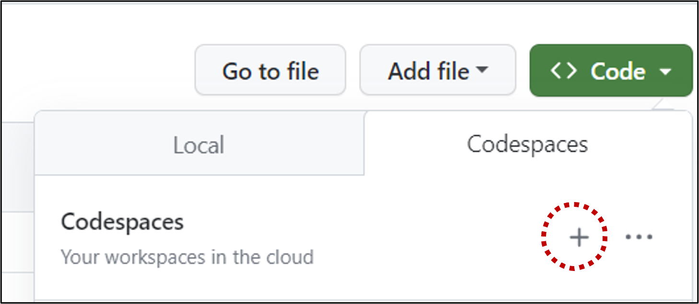
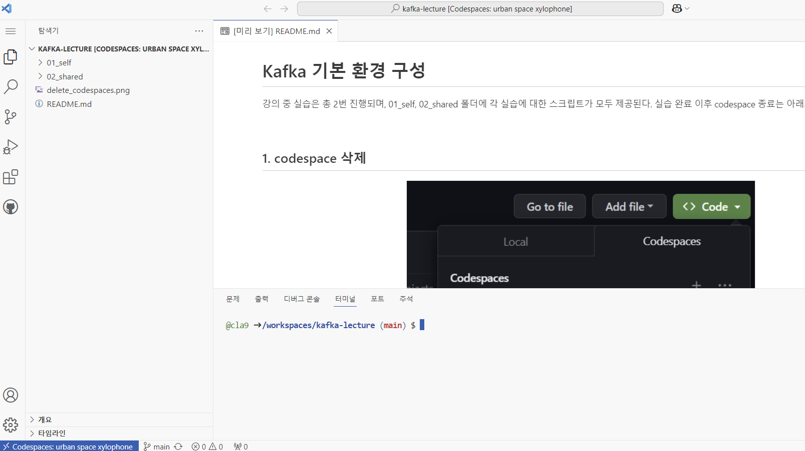
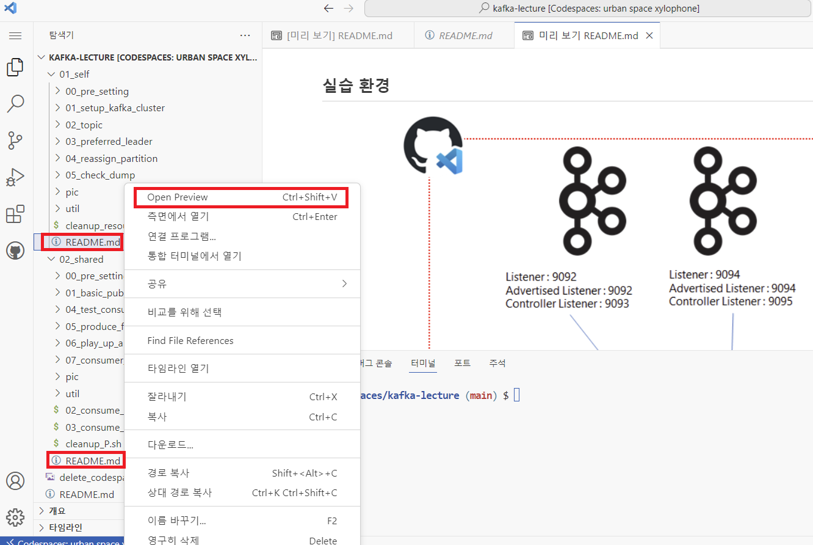
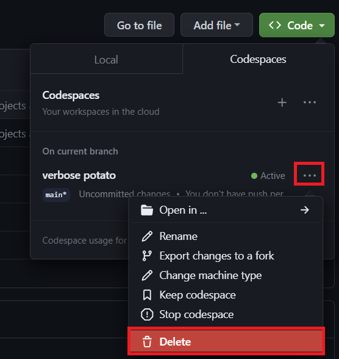

# Kafka 실습 환경 구성 가이드

## 1. Github 접속

실습을 위해서 https://github.com/cla9/kafka-lecture 이동 후 Github 로그인을 수행한다.

## 2. codespace 설정

### 2.1 codespace 환경 생성

  

Code > Codespaces 탭에서 + 버튼을 클릭하여 codespace에서 제공하는 VM 환경을 실행한다.

### 2.2 실행결과

  

그림과 같이 vscode 창이 보이면 정상적으로 실습을 위한 VM 환경이 구성되었다.

## 3. 실습 진행

강의 중 실습은 총 2번 진행되며, 01_self, 02_shared 폴더에 각 실습에 대한 스크립트가 모두 제공된다.

  

강의 교안은 01_self, 02_shared 폴더 하위에 README.md 파일로 존재한다.
파일 확인은 README.md 파일 클릭 > 마우스 오른쪽 버튼 > Open Preview 버튼을 선택하면, 교안 내용 확인이 가능하다.

 

교안 파일에 따라서 실습을 진행한다.

 

## 4. codespace 삭제

    

 

실습 완료 이후 codespace 종료는 아래와 같이 진행한다.
github에서 현재 기동중인 codespaces를 삭제한다.
